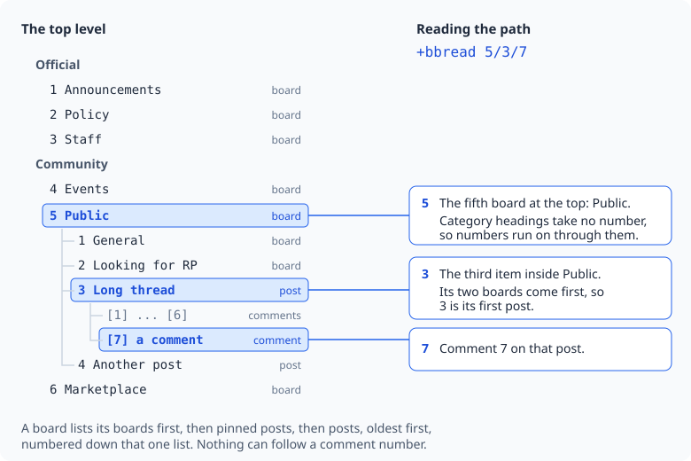
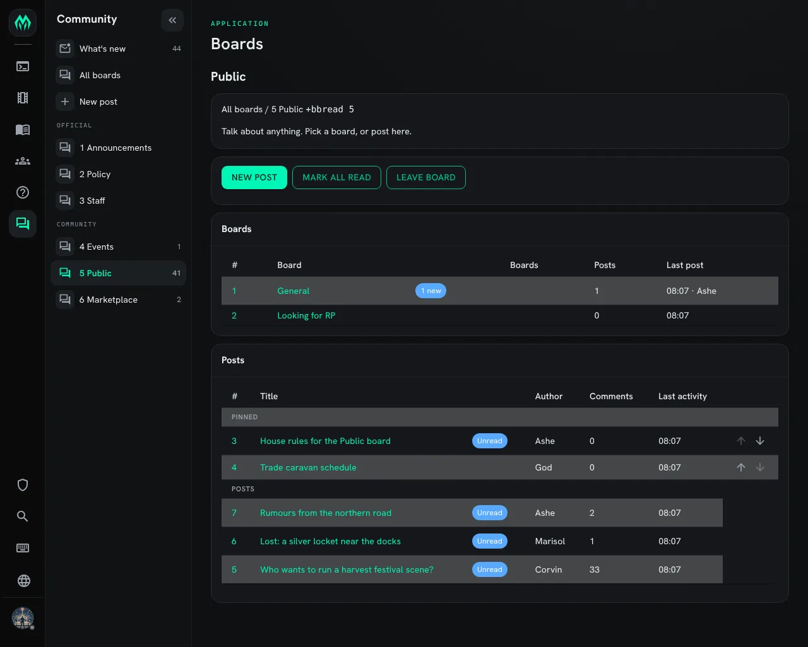
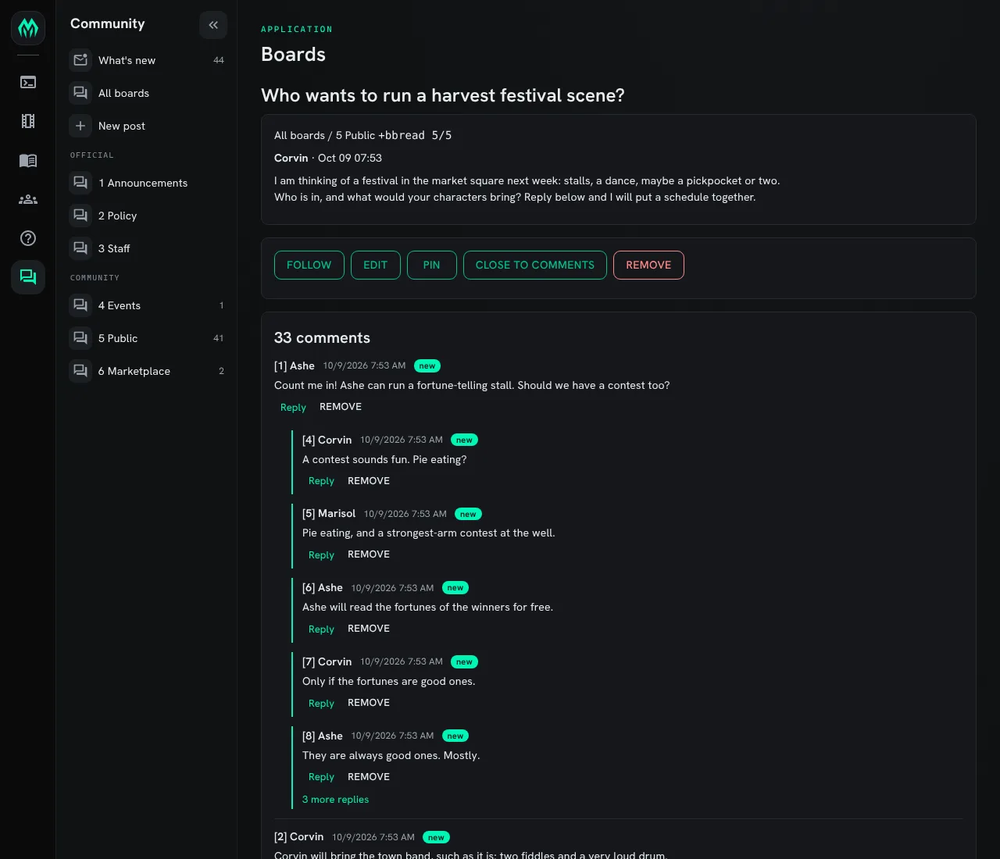

import { Aside } from '@astrojs/starlight/components';

**BBoards** is a bulletin board system for your game. Players read and write posts with
`+bb` commands, the same commands many MUSH players already know from Myrddin's boards.
On top of that, posts can have comments, comments can have replies, and boards can sit
inside other boards.

This page has a part for players and a part for staff:

| You are | You want to | Read |
|---|---|---|
| A player | read and write on the boards | [Numbers and paths](#numbers-and-paths) to [The reader](#the-reader) |
| A moderator | pin, close, move or remove posts | [Moderating](#moderating) |
| Staff | install the boards and set them up | [Running the boards](#running-the-boards) |
| A Myrddin player | know what changed | [For Myrddin players](#for-myrddin-players) |

In the game, `+help bboards` has the same commands in short form.

## What boards are

A **board** is a place for posts on one subject, such as Announcements or Events. A
**post** has a title and some text. Other players can **comment** on a post, and
**reply** to a comment, so a discussion stays with the post it is about.

A board can hold other boards. A game might keep a few boards at the top and group the
rest inside them. Staff can also put **category** headings over the boards at one level,
such as Official and Community.

Every board remembers what you have read. New posts and new comments both count as new,
so you can catch up on an old post that someone answered today.

## Numbers and paths

You never name a post by its title. Everything has a number, and you join numbers with
`/` to make a **path**:

- `5` is the fifth board at the top.
- `5/1` is the first thing inside board 5.
- `5/3/7` is comment 7 on post `5/3`.

Inside a board, its boards come first, then its pinned posts, then its other posts,
oldest first. One numbering runs down that whole list. So if board 5 holds two boards,
its first post is `5/3`.



Category headings take no number. On a new game the boards are numbered 1 to 6 across
both categories, Official first.

A board you can't read keeps its number. If you can't see board 3, your list goes 1, 2,
4, 5, 6, and board 5 is still 5 for everyone.

You can type a board's name instead of its number, or the start of its name:
`+bbread public/general` is the same as `+bbread 5/1`. Post and comment numbers are
always numbers.

### When numbers move

A number is a place in a list, so it can change. Pinning a post moves it up. Removing or
moving a post moves the ones after it up by one.

If a number you type has changed since you last looked at that board, the command stops
and tells you what the number points at now:

```
> +bbcomment 6/12=Still for sale?
[BBOARDS] Warning: The numbers on 6 have changed since you last looked. 6/12 is now "Swords".
Type the command again to go ahead, or +bbread 6 to see the list.
```

If that is the post you meant, type the same command again. If not, list the board and
use the new number.

## Reading

| Type | To see |
|---|---|
| `+bbread` | The boards you follow, with how many new things each has. |
| `+bbread 5` | Board 5: its boards and its newest posts. |
| `+bbread 5/3` | Post 5/3 and its comments. |
| `+bbread 5/3/7` | One conversation: comment 7 and every reply under it. |
| `+bblist` | Your boards as a tree. |
| `+bbread/all` | Every board you may read, followed or not. |

### The board list

`+bbread` on its own lists the top boards you follow:

```
> +bbread
===================================< Boards >===================================
#     Board                                                           New  Last
      Official
1     Announcements                                                        05:33
2     Policy                                                               05:33
      Community
4     Events                                                            1  05:37
5     Public  (2 boards)                                               51  05:37
6     Marketplace                                                     200  05:37
=============================< 5 boards, 252 new >==============================
+bbread <#> opens one.  +bbnext reads what's new.  +bbread/all lists all.
```

This player can't read board 3, Staff, so it is missing and the numbers skip it. The
last lines of every screen say what to type next.

### A board

`+bbread 6` opens board 6. A busy board opens on its **last** page, where the newest
posts are. Each row has a mark at the left:

- `U`: unread.
- `P`: pinned.
- `T`: times out soon.
- `+3` after the comment count: three comments are new to you.

To turn to another page, put the page number as a switch: `+bbread/1 6` is the oldest
page, `+bbread/2 6` the next. The page is always the **last** switch on the command, so
a command with other switches puts it at the end, as in `+bbsearch/text/2`.

### A post and its comments

`+bbread 5/3` shows the post, then its comments, ten to a page. `+bbread/2 5/3` is
page 2.

A comment that answers the post starts at the left margin. Replies to it sit under it,
two spaces in, in the order they were written. A reply to a reply says which comment it
answers with `re [n]`:

```
[1] Tomas, Oct 09 05:37
Does anyone know when the market opens?

  [2] Mira, Oct 09 05:40
  At dawn, most days.

  [3] Tomas, Oct 09 05:41, re [2]  (new)
  Thanks. Even on feast days?
```

Comment numbers belong to the post and count up in the order the comments were written.
Comments you haven't read are marked `(new)`, and in colour they stand out. Between the
post and its comments is a thin line with the comment count and the page.

### One conversation

A thread with a hundred comments is hard to follow. `+bbread 5/3/15` shows only the
conversation comment 15 belongs to: the comment at the margin that started it, and every
reply under it. Comment 15 is marked with `*` at the left.

### The tree

`+bblist` draws the boards you follow as a tree, with the boards inside boards shown
under them. Posts are not listed.

A deep tree stops a few levels down and says how many boards are below, for example
`(+12 boards below)`. To see the rest, start the tree lower down:

```
+bblist 5
+bblist 4/1/1/1
```

`+bbread/all` is the same kind of tree, but it lists every board you may read, including
boards you have left, and says what you may do on each: read, post, comment.
`+bbread/all 5` starts from board 5.

## Keeping up

### Reading what's new

`+bbnext` opens the next post with something new on it. For a post you haven't read,
you get the whole post. For a post you have read that has new comments, you get its
oldest ten new comments. Type `+bbnext` again to go on. The bottom line tells you how
many new things are left.

- `+bbnext 5` stays on board 5 and the boards inside it.
- `+bbnew` is another name for `+bbnext`.

### Seeing what's new

`+bbscan` gives one line for each board with something new, and which posts:

```
> +bbscan
Marketplace (#6): 3 unread (7, 9-10)
```

### Marking things read

- `+bbcatchup 6` marks board 6, and every board inside it, as read.
- `+bbcatchup all` marks everything read.

A new character starts with nothing read. A game that wants new players to start with
everything read can run `@force <player>=+bbcatchup all` when it approves them.

### Following boards

You follow every board you can read until you leave it. A board you follow shows in
`+bbread`, `+bblist` and `+bbnext`.

- `+bbleave 5` stops following board 5. You can still read it, and `+bbread/all` still
  lists it.
- `+bbjoin 5` follows it again. Everything on it counts as new.

### Notices

When someone posts on a board you follow, you get a one-line notice.

- `+bbnotify 5=off` stops the notices for board 5. New posts there still count as new.
  `+bbnotify 5=on` starts them again.
- `+bbnotify off` turns notices off on every board. `+bboptions notify=off` does the
  same.

### Following one post

`+bbfollow 5/3` tells you about every new comment on post 5/3. `+bbunfollow 5/3` stops.

## Writing

### Posting

```
+bbpost 6/Selling a horse=A good grey mare. Ask Mira.
```

That posts at once on board 6, with the title `Selling a horse`. The part before the
`/` is the board; it can be a path, such as `5/1` for General inside Public.

For a longer post, start a draft and add to it a line at a time:

```
+bbpost 6/Selling a horse
+bbwrite A good grey mare, five years old.
+bbwrite She is calm around crowds.
+bbproof
+bbpost
```

- `+bbpost <board>/<title>` with no `=` starts the draft.
- `+bbwrite <text>` adds a line.
- `+bbproof` shows the draft so far.
- `+bbpost` alone posts it.
- `+bbtoss` throws it away.

### Comments and replies

```
+bbcomment 6/4=Is she still for sale?
+bbreply 6/4/2=Yes, until Friday.
```

`+bbcomment` comments on a post. `+bbreply` answers one comment: `6/4/2` is comment 2
on post 6/4. The reply sits under the comment it answers, so each conversation stays
together.

A post holds at most 150 comments, unless staff change that number. A moderator can
also close a post to comments.

### Changing what you wrote

| Type | To |
|---|---|
| `+bbedit 6/4=grey/white` | Change `grey` to `white` in your post. |
| `+bbedit 6/4=1/2^^^half` | Use `^^^` in place of `/` when the text has a slash in it. |
| `+bbedit/all 6/4=<text>` | Replace the whole text. |
| `+bbedit/title 6/4=<title>` | Change the title. |
| `+bbedit 6/4/2=Friday/Sunday` | Change your comment 2 on post 6/4. |
| `+bbremove 6/4` | Remove your post. |
| `+bbremove 6/4/2` | Remove your comment. |

When you remove a post, the posts after it move up one. A post that has comments keeps
its place, marked as removed, so its comments can still be read. A comment with replies
works the same way.

## Markdown or SharpMUSH text

Posts and comments are **Markdown** unless you say otherwise. Markdown is plain text
with a few marks:

- A blank line starts a new paragraph.
- `*stars*` around words make them stand out.
- `%r` starts a new line.

Markdown text is kept exactly as you typed it and looks the same to everyone.

Add `/mush` to write **SharpMUSH text** instead, with colour and functions:

```
+bbpost/mush 4/Feast night=[ansi(hy,Tonight)] in the great hall.
```

SharpMUSH text is worked out once, as you, at the moment you post it. What it produced
is kept, and nothing in it runs again when others read it. `/mush` works on
`+bbpost`, `+bbcomment`, `+bbreply` and `+bbedit`.

If you write SharpMUSH text most of the time, make it your default:

- `+bboptions` shows your settings.
- `+bboptions format=mush` makes SharpMUSH text your default.
- `+bboptions format=md` goes back to Markdown.
- `/md` on one post or comment asks for Markdown when your default is SharpMUSH text.

## Searching

- `+bbsearch 6/Mira` lists Mira's posts on board 6.
- `+bbsearch/text 6/horse` lists posts and comments with the word `horse`, on board 6
  and the boards inside it.

A search looks at the newest 250 posts. If there are more, it says so. Add a page
number to look further back: `+bbsearch/2 6/Mira`, `+bbsearch/text/2 6/horse`.

## The reader

`+bbreader` opens a reader where every line you type is a key. You can move around the
boards one letter at a time. `+bbreader 5/3` opens it at post 5/3.

Nothing you type in the reader runs as a command. To page someone or pose, leave with
`q` first.

| Key | Does |
|---|---|
| Enter or `n` | The next new thing, what `+bbnext` shows. |
| A number | Open that board, post or comment where you are. |
| A path, such as `5/3` | Open it from anywhere. |
| `j` and `k` | The next or previous comment in a thread, or page in a board. |
| `J` and `K` | The next or previous post on the board. |
| `p` | The comment this one answers. |
| `t` | The whole thread. |
| `u` | Up one level. |
| `c <text>` | Comment on this post. |
| `r <text>` | Reply to this comment. |
| `c` or `r` alone | Write several lines. A line of just `.` posts them; `.toss` drops them. |
| `e <old>/<new>` | Edit what you wrote here. |
| `f` | Follow this post, or stop following it. |
| `m` | Mark this board read. |
| `l` | Show this screen again. |
| `?` | List the keys. |
| `q` | Leave the reader. |

## In the portal

When your game has installed `bboards-app`, the portal has a **Boards** page under
**Community**. It shows the same boards, posts and comments as the `+bb` commands, with the
same numbers, and it obeys the same locks: a board you can't read in the game isn't on the
page either.

The side menu has **What's new**, with a count of everything you haven't read, **All
boards**, **New post**, and every board you follow with its own count.



A board's page lists its sub-boards and then its posts, pinned posts first. Its buttons
do what the commands do:

| Button | Same as |
|---|---|
| New post | `+bbpost` |
| Mark all read | `+bbcatchup <board>` |
| Follow board or Leave board | `+bbjoin` or `+bbleave` |

A moderator also sees up and down arrows on pinned posts. They change the order the pins
are shown in, for everyone.



A post's page shows its text and its comments, a few conversations to a page. Replies sit under the
comment they answer, as in [One conversation](#one-conversation). When a conversation is
long, "more replies" opens all of it. **Reply** under a comment opens it so you can answer;
the box at the bottom of the page comments on the post. "Written in" picks Markdown or
SharpMUSH text, as `/md` and `/mush` do.

Above the post are the buttons you are allowed to use: **Follow**, **Edit** and
**Remove** for your own post, and for a moderator **Edit**, **Remove**, **Pin** and
**Close to comments** on any post.

Editing in the portal replaces the whole text, like `+bbedit/all`. When a moderator edits a
comment or post someone else wrote as SharpMUSH text, the box starts empty: the author's
code is never copied in, so saving can't run it as the moderator.

Every page shows the command it matches, such as `+bbread 5/5`, so you can do the same
thing in the game.

## Moderating

A board's moderators are the people who pass its **moderate** lock (see
[Locks](#locks)). Anyone with the **BBoard Moderator** role moderates every board they
can read. Moderators can do this on any post on their boards:

| Type | To |
|---|---|
| `+bbpin 5/9` | Pin post 5/9 to the top of the board. |
| `+bbpin 5/9=1` | Move a pinned post to first place among the pins. |
| `+bbpin 5` | List board 5's pins. |
| `+bbunpin 5/4` | Put a pinned post back in date order. |
| `+bbclose 5/4` | Stop new comments on a post. |
| `+bbopen 5/4` | Allow comments again. |
| `+bbmove 5/4 to 6` | Move a post, with its comments, to board 6. |
| `+bbtimeout 5/4=30` | Remove the post 30 days after its last activity. |
| `+bbtimeout 5/4=never` | Keep the post. `=default` uses the board's setting. |

Moderators can also use `+bbedit` and `+bbremove` on anyone's post or comment.

Pinning, unpinning and moving all change the numbers of other posts, so the
[renumber check](#when-numbers-move) may ask you to type a command twice.

## Running the boards

### Installing

BBoards ships with the server but is not installed on a new game. An administrator
installs it from the portal:

1. Open **Packages** in the admin area and choose **Browse**.
2. Install `bboards`. It needs `plus-help` and `http-handler`, which a new game already has.
3. To show the boards in the portal as well, install `bboards-app`. See
   [In the portal](#in-the-portal).

See [Softcode Packages](/guides/packages) for how installing, upgrading and rolling back
work.

### The boards you start with

| # | Board | Category | Who may post | Notes |
|---|---|---|---|---|
| 1 | Announcements | Official | BBoard Admins | Anyone may comment. |
| 2 | Policy | Official | BBoard Admins | No comments. |
| 3 | Staff | Official | Wizards and BBoard Admins | Only wizards and BBoard Admins can see it. |
| 4 | Events | Community | Approved players | |
| 5 | Public | Community | Approved players | Holds 5/1 General and 5/2 Looking for RP. |
| 6 | Marketplace | Community | Approved players | |

Everyone can read every board except Staff. "Approved players" means players with the
`approved` role. If your game doesn't approve players, change the post locks on boards
4, 5 and 6 (see [Locks](#locks)).

### Roles

The package adds two roles:

| Role | Can |
|---|---|
| **BBoard Admin** (`bboard-admin`) | Make, set up, order, lock and remove boards. Moderate and read every board. |
| **BBoard Moderator** (`bboard-moderator`) | Moderate every board they can read. |

Give one with `@role/assign`:

```
@role/assign Mira=bboard-moderator
```

To make someone a moderator of one board only, don't give them a role. Put them in that
board's moderate lock instead.

The commands below need the BBoard Admin role.

### Making and moving boards

| Type | To |
|---|---|
| `+bbnewgroup Trade` | Make a board at the top. |
| `+bbnewgroup 5/Plots` | Make a board inside board 5. |
| `+bbcleargroup 7` | Remove board 7 if it is empty. |
| `+bbcleargroup/confirm 7` | Remove board 7 and its posts. |
| `+bbparent 7=5` | Move board 7, and everything in it, inside board 5. |
| `+bbparent 5/3=top` | Move board 5/3 to the top level. |
| `+bborder 6=up` | Move board 6 up one among the boards of its category. `=down` moves it down. |
| `+bborder 6=1` | Move board 6 to first place in its category. |

A board that holds other boards can't be removed until those are moved or removed.

Moving or reordering boards changes their numbers for everyone. Tell your players when
you do it.

### Categories

A category is a heading over some of the boards at one level. Boards in no category are
listed last, under **Other boards**.

| Type | To |
|---|---|
| `+bbcategory/create Out of Character` | Make a category at the top level. |
| `+bbcategory/create 5/Plots` | Make a category inside board 5. |
| `+bbcategory 7=Out of Character` | Put board 7 in that category. `=none` takes it out. |
| `+bbcategory/rename Out of Character=OOC` | Rename a category. |
| `+bbcategory/order OOC=1` | Make it the first category. |
| `+bbcategory/delete OOC` | Remove a category. Its boards stay, in no category. |

For a category inside a board, put the board first, as in `/create`:
`+bbcategory/rename 5/Plots=Stories`.

Boards are numbered down the categories in order, so changing a category or its place
renumbers the boards at that level.

### Settings

- `+bbinfo 5` shows a board's settings and locks, and which board a lock comes from.
- `+bbconfig` shows the defaults.
- `+bbconfig all` shows every board's settings and locks in two tables.
  `+bbconfig all 5` starts from board 5.

Change a setting with `+bbconfig <board>/<option>=<value>`:

| Option | What it is | Example |
|---|---|---|
| `name` | The board's name. | `+bbconfig 6/name=Market Square` |
| `description` | A line shown at the top of the board. | `+bbconfig 6/description=Buying, selling and trading.` |
| `color` | The colour of the board's name. | `+bbconfig 1/color=hy` |
| `timeout` | Days after its last activity before a post is removed. `0` means never. | `+bbconfig 6/timeout=60` |
| `pins` | How many posts may be pinned, 0 to 10. | `+bbconfig 1/pins=3` |
| `comments` | The most comments a post may hold, 1 to 200. | `+bbconfig 5/comments=200` |
| `anonymous` | A name shown in place of the poster's. | `+bbconfig 4/anonymous=A Rumour` |

`+bbconfig default/<option>=<value>` changes the default for boards that don't set
their own: `+bbconfig default/timeout=90`.

### Locks

Each board has four locks. You write them the way `@lock` takes them.

| Lock | Decides | Example |
|---|---|---|
| `read` | Who may see the board. | `+bblock 3/read=role^wizard` |
| `post` | Who may start posts. | `+bblock 5/post=role^approved` |
| `comment` | Who may comment and reply. | `+bblock 1/comment=role^approved` |
| `moderate` | Who moderates the board. | `+bblock 4/moderate=role^storyteller` |

`storyteller` here stands for any role your game has.

`+bbwritelock 5=<lock>` is the same as `+bblock 5/post=<lock>`.

A board with no lock of a kind takes it from the board it is in. For example, board 5,
Public, has the post lock `role^approved`. General (5/1) and Looking for RP (5/2) set
no post lock, so only approved players can post there too.

A board's own lock replaces the one above it. To let only storytellers post on General,
while any approved player can still post on Public itself:

```
+bblock 5/1/post=role^storyteller
```

To clear a lock, so the board takes it from the board above again, leave the lock empty:

```
+bblock 5/1/post=
```

A few more examples:

```
+bblock 3/read=role^wizard|perm^softcode.bboards.admin
+bblock 5/2/moderate=role^storyteller
+bblock 6/comment=role^approved
```

At the top, a board with no lock lets everyone read, post and comment, and nobody
moderate except the people with the roles above. A board you can't read hides the
boards inside it as well.

<Aside type="tip">
`+bbinfo` shows each lock and, when it comes from a board above, which board. Check it
after you change a lock.
</Aside>

## For Myrddin players

If you have used Myrddin's bulletin board, most of what you type still works.

### Works the same

| You type | It does |
|---|---|
| `+bbread` | Lists the boards you follow, with what's new. |
| `+bbread 2` | Lists board 2. |
| `+bbread 2/5` | Reads post 5 on board 2, now with its comments. |
| `+bbpost 2/<title>=<text>` | Posts. |
| `+bbpost 2/<title>`, `+bbwrite`, `+bbproof`, `+bbtoss`, `+bbpost` | The draft. |
| `+bbnext`, `+bbnew` | Reads the next new thing. |
| `+bbscan` | One line per board with something new. |
| `+bbcatchup 2`, `+bbcatchup all` | Marks boards read. |
| `+bbleave 2`, `+bbjoin 2` | Stops and starts following a board. |
| `+bbnotify 2=off` | Turns off new-post notices for a board. |
| `+bbedit 2/5=<old>/<new>` | Changes your post. `^^^` works in place of `/`. |
| `+bbremove 2/5` | Removes your post. The posts after it move up one. |
| `+bbmove 2/5 to 3` | Moves a post. |
| `+bbsearch 2/<name>` | Finds posts by someone. |
| `+bbtimeout 2/5=<days>` | Sets when a post times out. |
| `+bbnewgroup`, `+bbcleargroup` | Makes and removes boards. |
| `+bbwritelock 2=<lock>` | Sets who may post. |
| `+bbconfig 2/timeout=<days>`, `+bbconfig 2/anonymous=<name>` | Board settings. |

### Different

- **Boards hold boards.** A board number can be a path, like `5/1`. Inside a board,
  its boards come first, then its posts.
- **The renumber check.** If a number has changed since you last listed the board, the
  command stops and tells you, instead of acting on a different post. Type it again to
  go ahead.
- **`+bblist`** draws the boards you follow as a tree. `+bbread/all` lists every board
  you may read.
- **`+bblock`** takes a lock kind and an `@lock` lock: `+bblock 5/post=role^approved`.
- **`+bbcatchup`** on a board also catches up the boards inside it.
- **Text is Markdown** unless you add `/mush`.

### New

- Comments and replies: `+bbcomment`, `+bbreply`, and `+bbread <post>/<#>` for one
  conversation.
- `+bbreader`, for moving around with single keys.
- `+bbfollow` and `+bbunfollow`, for one post's comments.
- `+bbsearch/text`, to search what posts and comments say.
- `+bboptions`, for your format and notices.
- For moderators: `+bbpin`, `+bbunpin`, `+bbclose`, `+bbopen`.
- For staff: `+bbinfo`, `+bborder`, `+bbparent`, `+bbcategory`, the `read`, `post`,
  `comment` and `moderate` locks, and the `name`, `color`, `description`, `pins` and
  `comments` settings.
