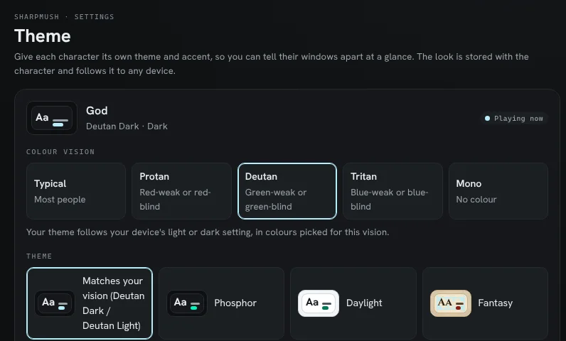

import { Aside, Steps } from '@astrojs/starlight/components';

About one man in twelve and one woman in two hundred see colour differently from most people. The web portal
uses colour to tell things apart: an allowed permission is green and a denied one red, a link is one colour and a
link to a missing page another. For many players those pairs look the same.

Each character can name its **colour vision**. The portal then uses colours that stay apart for that vision.

## The choices

| Choice | Who it is for | What runs together for them |
|---|---|---|
| **Typical** | Most people. This is the default. | |
| **Protan** | Red-weak or red-blind (protanomaly, protanopia) | Reds and greens; reds look dark |
| **Deutan** | Green-weak or green-blind (deuteranomaly, deuteranopia). The most common kind. | Reds and greens |
| **Tritan** | Blue-weak or blue-blind (tritanomaly, tritanopia) | Blues and greens, yellows and pinks |
| **Mono** | No colour at all (achromatopsia, blue cone monochromacy) | Everything but light and dark |

If you are "a bit colour-blind" and not sure which kind, Deutan is the likeliest. You can try each one and keep
whichever makes the portal easiest to read.

## Choose yours

<Steps>

1. Open the account menu (your picture at the bottom of the sidebar) and choose **Theme**. The page is also under
   **Settings > Preferences > Theme**.

2. Under **Colour vision**, choose yours. It is saved at once and stays with the character, on every device.

</Steps>

What changes depends on whether you have picked a theme:

- **No theme picked** (the first choice in the theme list): you get your vision's own theme. It is dark or light
  to match your device, and switches when your device does. The first choice in the list now reads
  **Matches your vision**.
- **A theme picked**: your theme stays. Only the colours the portal works out for it change: the ones for allowed
  and denied, notices and roles, and the colours in code. Your theme's own accent, warning and missing-link
  colours stay as the theme set them. To change those too, pick **Matches your vision** again.

Each character keeps its own setting, so if you play several, set it on each.

## Why you have to choose

Browsers do not tell a web page about colour blindness. There is a setting a page can read for dark or light, and
one for extra contrast, but none for colour vision. Windows, macOS, Android and iOS all have colour filters for
colour blindness, but they change the screen after the page is drawn, so the page never knows. That is why the
portal asks.

If you already use your system's colour filter, you may not need this setting, or you may prefer it to the filter:
the filter shifts every colour on the screen, while this changes only the portal's.

## What it looks like

These are the **Allow** and **Deny** buttons on the Roles page, with one permission allowed and the next denied.
Each picture is drawn as a reader with that vision sees it. On the left is the default Phosphor theme, where Allow
and Deny come out nearly the same colour for protan and deutan readers. The other columns are each vision's own
dark and light themes.

## The themes

Each vision has a dark and a light theme. They keep the plain look of Phosphor and Daylight, and change the
colours that carry meaning.

| Theme | Accent (links) | Warnings | Missing links and errors |
|---|---|---|---|
| Protan Dark | pale sky blue | yellow | orange |
| Protan Light | ocean blue | ochre | brown |
| Deutan Dark | pale sky blue | yellow | salmon |
| Deutan Light | deep blue | ochre | dark red |
| Tritan Dark | pink | cream | red |
| Tritan Light | crimson | ochre | dark red |
| Mono Dark | blue, darker than the text | pale cream | pale pink |
| Mono Light | navy | olive | dusty rose |

You can also pick any of these from the theme list directly, without naming a vision. Then it stays dark or light
whatever your device does.

<Aside type="note">
These colours were picked by simulating each vision with the model most colour-blindness tools use (Machado,
Oliveira and Fernandes, 2009), at full strength, so they also hold for the milder "-anomaly" forms. Every colour
still reads against its background at 4.5:1, the WCAG AA level for text.

Mono can only use light and dark, and there are too many colours to give each its own lightness and keep them all
readable. In the Mono themes the pairs you read side by side (allowed and denied, a link and a missing link, a
warning and an error) differ in lightness. Code is coloured as usual.
</Aside>

## What it does not change

- **Colours sent by the game.** Text a game colours with ANSI codes (a red "OOC", a green channel name) is shown
  as the game sent it, in the portal's terminal and in a MU\* client. Most MU\* clients let you set your own
  colour for each of the sixteen ANSI colours; that is the place to change them.
- **Layout themes.** The boxes and tables a game draws in a MU\* client follow its [layout
  themes](/guides/layout-themes). Their colours are decoration, not meaning.
- **Pictures** in the wiki and in scenes.

## For staff: a theme for a colour vision

A theme you make in **Admin > Portal > Themes** can say which colour vision it is made for. Open the theme, and
under **Colour vision** choose one. The theme then works out its status and code colours from that vision's set,
whoever uses it.

The setting does not pick the theme's own colours for you. Choose an accent, warning and missing-link colour that
stay apart for that vision; the built-in themes in the table above are a good starting point, and **Duplicate**
copies one.

See [Portal Themes](/guides/portal-themes) for everything else about making themes.
