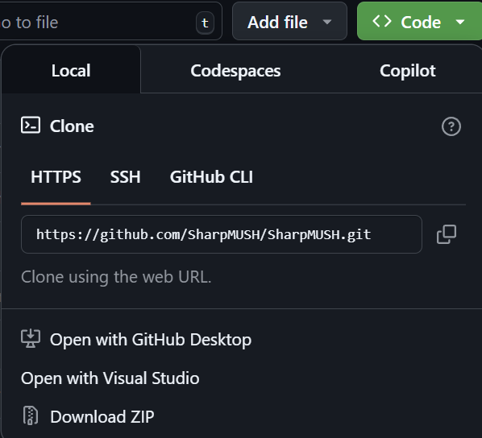
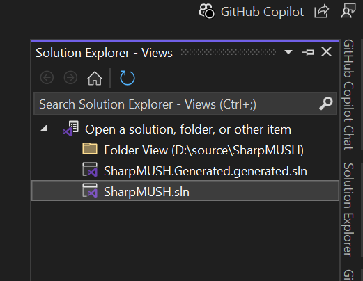

import { Steps } from '@astrojs/starlight/components';

SharpMUSH can easily be installed locally, or on a remote server, thanks to Docker.
It is a simple, yet powerful, web application that can be used to create and manage your own MUSH.

# Local Install
Coming soon.

# Install from Source
This is the best option if you want to do any kind of modifications of the hardcode itself.
It is also the best option if you want to contribute to the project.

## Prerequisites
- [Docker](https://www.docker.com/products/docker-desktop/) to run the application.
- [Visual Studio](https://visualstudio.microsoft.com/vs/) or [Jetbrains Rider](https://www.jetbrains.com/rider/) to build the application.

## Steps
<Steps>
1. Clone the repository from [GitHub](https://github.com/SharpMUSH/SharpMUSH).

    

    Open with Visual Studio, or if you have git installed:

    ```bash
    git clone https://github.com/SharpMUSH/SharpMUSH.git
    ```

2. Open the SharpMUSH solution.

    

3. Build the Solution.

    Ensure that the SharpMUSH.Server project is selected as the startup project.
    

    Press F6 to build the solution.

4. Start SharpMUSH!

    Press Ctrl-F5 to start the application in non-debug mode.
    
    An output window will appear and show where to connect.

</Steps>

# Host on a Remote Server
Coming soon.

## Further reading

- Read [about how-to guides](https://diataxis.fr/how-to-guides/) in the Diátaxis framework
