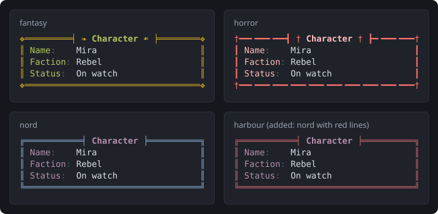

import { Aside, Steps } from '@astrojs/starlight/components';

A layout theme decides how SharpMUSH's layouts look in a player's MU\* client: the colour of a
box's border and title, the field labels in a character sheet, the bullets in a list, the bar in a
gauge. The words and the layout stay the same. Only the paint changes.



This page covers four jobs:

- choosing the game's theme, the one everybody sees unless they pick another;
- letting players choose their own;
- adding themes of your own and turning off the built-in ones you do not want;
- giving a group of players, such as a faction, a theme of its own.

Themes apply to telnet and other MU\* clients. The web portal has its own themes, which staff
manage in the portal's admin area: see [Portal Themes](/guides/portal-themes).

## See what is available

`@theme/list` shows every theme the game knows and whether players can use it. Anyone can run it.
It is drawn to fit the client's width; this is a client 60 columns wide:

```text
> @theme/list
╭─────────────────────┤ Layout themes ├────────────────────╮
│ Theme             Kind      Status                       │
│ ───────────────────────────────────                      │
│ terminal          built-in  offered                      │
│ fantasy           built-in  offered                      │
│ historical        built-in  offered                      │
│ horror            built-in  offered                      │
│ modern            built-in  offered                      │
│ mystery           built-in  offered                      │
│ romance           built-in  offered                      │
│ science-fiction   built-in  offered                      │
│ spiritual         built-in  offered                      │
│ catppuccin-mocha  built-in  offered                      │
│ catppuccin-latte  built-in  offered                      │
│ dracula           built-in  offered                      │
│ gruvbox-dark      built-in  offered                      │
│ nord              built-in  offered                      │
│ solarized-dark    built-in  offered                      │
│ solarized-light   built-in  offered                      │
│ tokyo-night       built-in  offered                      │
╰──────────────────────────────────────────────────────────╯
```

The first nine are made for game genres. The rest are well-known colour schemes from code editors
and terminals. The `themes()` function gives the names a player can choose, as a list softcode can use:

```sharp
> think themes()
terminal fantasy historical horror modern mystery romance science-fiction spiritual catppuccin-mocha catppuccin-latte dracula gruvbox-dark nord solarized-dark solarized-light tokyo-night
```

To see a theme's colours, and whether each one is easy to read against the background, use
`swatch()`. The second argument is the width; leave it out to fit the reader's client:

```sharp
> think swatch(nord,62)
Role        Sample  Colour   16-colour       Contrast
--------------------------------------------------------------
background  -       #2e3440  0 black         -
surface     Sample  #3b4252  8 bright black  -
foreground  Sample  #e5e9f0  7 white         10.3:1
primary     Sample  #81a1c1  4 blue          4.6:1
secondary   Sample  #b48ead  5 magenta       4.4:1 (needs 4.5)
tertiary    Sample  #88c0d0  6 cyan          6.2:1
muted       Sample  #4c566a  8 bright black  1.7:1 (needs 3)
success     Sample  #a3be8c  2 green         6.1:1
warning     Sample  #ebcb8b  3 yellow        8.0:1
error       Sample  #bf616a  1 red           3.1:1 (needs 4.5)
info        Sample  #88c0d0  6 cyan          6.2:1
```

In a client the Sample column is drawn in each colour. The 16-colour column is what a client with
only the basic sixteen colours gets instead.

## Choose the game's theme

The `layout_theme` game option is the theme everyone sees until they choose their own. A wizard
sets it with `@config/set`:

```sharp
> @config/set layout_theme=nord
Option set.
> think config(layout_theme)
nord
```

With `layout_theme` empty, layouts have no colour. The `terminal` theme uses only the sixteen
standard colours, so each player sees it in the colours their own client is set to.

## Players choose their own

A player sets a theme for themselves with `@theme me=`, and checks which one is in use with
`@theme/refresh`:

```sharp
> @theme me=fantasy
Theme set.
> @theme/refresh
Theme in use: fantasy
```

`@theme/light` and `@theme/dark` make a theme for a client with a light or a dark background. A
genre theme has its colours chosen again for that background:

```sharp
> @theme/light me=fantasy
Theme set.
> @theme/refresh
Theme in use: {"preset":"fantasy","mode":"light"}
```

A theme the game does not offer is refused, and the player keeps the one they had. `@theme me=`
with nothing after the `=` goes back to the game's theme:

```sharp
> @theme me=nosuch
#-1 UNKNOWN THEME
> @theme me=
Theme cleared.
> @theme/refresh
No theme is set, so layouts use the game's theme.
```

<Aside type="note" title="Which theme wins">
A player's own theme beats the game's `layout_theme`. A theme that softcode names for one particular
layout, with the `"theme"` option, beats both: a red warning box stays red whatever the player
chose.
</Aside>

## Add your game's own themes

Staff with the `layout.admin` permission can add themes, remove the ones they added, and turn the
built-in ones off and on again. Players see every change straight away.

A theme is added with `@theme/add <name>=<theme>`. The easiest way to write one is to start from a
built-in theme with `"preset"` and change what you want. This one is nord with red borders:

```sharp
> @theme/add harbour={{"preset":"nord","colors":{"primary":"#bf616a"}}}
Theme harbour saved.
```

The theme is written in JSON inside **two** pairs of braces. SharpMUSH removes the outer pair when it
reads the command, the same as for a layout function's options. A name is lower-case letters, digits
and hyphens, and cannot be the name of a built-in theme.

Players can now choose it like any other:

```sharp
> @theme me=harbour
Theme set.
```

To take a built-in theme off the list, disable it. Players who were using it go back to the game's
theme and are told why:

```sharp
> @theme/disable fantasy
Theme fantasy disabled.
```

A player who tries to choose it now is told it does not exist:

```sharp
> @theme me=fantasy
#-1 UNKNOWN THEME
```

`@theme/enable` puts it back:

```sharp
> @theme/enable fantasy
Theme fantasy enabled.
```

`@theme/remove harbour` removes an added theme. Players without `layout.admin` who try any of these
are told `Permission denied.`

### What you can change in a theme

| Key | What it does | Example |
|---|---|---|
| `"preset"` | The theme to start from. | `"preset":"nord"` |
| `"colors"` | Replaces single colours, by the roles `swatch()` lists: `primary` (borders, rules, gauge bars, table headings), `secondary` (titles and field labels), `tertiary` (bullets), `muted` (separators and tree lines), and `success`, `warning`, `error` and `info` for badges and notices. | `"colors":{"primary":"#bf616a"}` |
| `"seed"` | Makes a whole theme from one colour. | `"seed":"#d08770"` |
| `"harmony"` | With `"seed"`, how the other colours are picked: `monochrome`, `analogous` (the default), `complementary`, `split`, `triadic` or `tetradic`. | `"harmony":"triadic"` |
| `"contrast"` | With `"seed"`, from 0 to 1: how much more each colour stands out than it must. | `"contrast":0.5` |
| `"mode"` | `"light"` or `"dark"`: which background the colours are chosen for. | `"mode":"light"` |
| `"look"` | Shapes rather than colours: `"border"`, `"title"` (the pieces either side of a title), `"bullet"`, `"guide"` (tree lines), `"gauge"`, `"separator"` (after a field label) and `"rule"` (under table headings). | `"look":{"bullet":"-"}` |

A theme made from one colour:

```sharp
> @theme/add ember={{"seed":"#d08770","harmony":"split"}}
Theme ember saved.
```

<Aside type="caution" title="Square brackets need a backslash">
SharpMUSH runs anything inside `[ ]` as code, even inside braces. A list in your JSON, such as a
title's brackets, is written `\[ \]`:

```sharp
> @theme/add plainfantasy={{"preset":"fantasy","look":{"bullet":"-","title":\["( "," )"\]}}}
Theme plainfantasy saved.
```
</Aside>

The full list of keys is in the [layout themes reference](/reference/sharpmush-help/layout-functions/#layout-themes).

## A theme for each faction

A player who has no theme of their own takes the one set on their parent object, then their
parent's parent, and finally the one set on the player ancestor, the object every player inherits
from. So a theme set on a faction's parent object reaches everyone in it.

<Steps>
1. Create an object for the faction, or use the one you already parent its members to:

   ```sharp
   > @create Rebel Faction
   Created: Object #14.
   ```

2. Give it a theme. `@theme` works on any object you control:

   ```sharp
   > @theme Rebel Faction=horror
   Theme set.
   ```

3. Parent each member to it. Their theme changes at once:

   ```sharp
   > @parent *Mira=Rebel Faction
   Parent changed.
   > @theme/refresh *Mira
   Theme in use: horror
   ```
</Steps>

A player who sets their own theme keeps it. When they clear it with `@theme me=`, they go back to
their faction's.

## One theme that decides for itself

`@theme` keeps exactly what you type, and works it out each time it is needed, as the player it is
for. So instead of a theme you can store a little softcode that picks one. `%#` is the player.

This goes on the player ancestor, `#4` unless your game has moved it (`think config(ancestor_player)`
says where it is). Players whose `FACTION` is `Rebel` get horror, those in the `Crown` get nord, and
everyone else gets the game's theme:

```sharp
> @theme #4=[switch(get(%#/FACTION),Rebel,horror,Crown,nord)]
Theme set.
> &FACTION *Tobin=Crown
Tobin/FACTION - Set.
> @theme/refresh *Tobin
Theme in use: nord
```

The theme is worked out when the player connects, when someone runs `@theme` on them or on an
object they inherit from, and when someone runs `@theme/refresh <player>`. Setting `FACTION` does
not by itself change the theme a connected player sees, so code that changes it should run
`@theme/refresh %#` afterwards. Here is a `+join` command that sets a player's faction and their
theme in one go. It sets an attribute on the player, so its object needs to control the players who
use it; this one has the `WIZARD` flag. A new object ignores $-commands until `NO_COMMAND` is
cleared:

```sharp
> @create Faction Desk
Created: Object #20.
> @set Faction Desk=WIZARD
Faction Desk - WIZARD set.
> @set Faction Desk=!NO_COMMAND
Faction Desk - NO_COMMAND reset.
> &CMD`JOIN Faction Desk=$+join *:&FACTION %#=%0; @theme/refresh %#
Faction Desk/CMD`JOIN - Set.
> drop Faction Desk
You drop Faction Desk.
```

When a player in the same room types `+join Rebel`, the next layout they read is in horror:

```sharp
> +join Rebel
> @theme/refresh
Theme in use: horror
```

<Aside type="tip" title="Try before you save">
Layout functions take a `"theme"` option, so you can see a theme on one box before anyone else does:

```sharp
> think box(fields(,Name,Mira,Faction,Rebel,Status,On watch),Character,36,{{"theme":"harbour"}})
╔═══════════╡ Character ╞══════════╗
║ Name:    Mira                    ║
║ Faction: Rebel                   ║
║ Status:  On watch                ║
╚══════════════════════════════════╝
```

That is the box as a client with Unicode gets it, in nord's colours with red lines.
</Aside>

## When something goes wrong

| What you see | What it means |
|---|---|
| `#-1 UNKNOWN THEME` | The name is misspelled, or the theme was disabled or removed. `@theme/list` shows what there is. |
| `#-1 INVALID THEME: ...` | The JSON is not right. The rest of the message says which part. |
| `Permission denied.` | Adding, removing, disabling and enabling themes needs `layout.admin`. Setting a theme on an object needs control of it. |
| The theme set but nothing changed | The player may have a theme of their own, which beats a parent's. `@theme/refresh <player>` says which one is in use. |
| JSON with a list stopped working | A `[` in the theme ran as code. Write lists as `\[ \]`. |

When a player connects with a theme that no longer works, for example one that was removed, they
see the game's theme and are told why.

## Reference

- [@theme](/reference/sharpmush-help/layout-functions/#theme-1): the full command.
- [@theme/list](/reference/sharpmush-help/layout-functions/#themelist): adding, removing,
  disabling and enabling themes.
- [Layout themes](/reference/sharpmush-help/layout-functions/#layout-themes): every key a theme
  can have.
- [Visual Layouts and Themes](/guides/visual-layouts/): the layout functions themes apply to.
