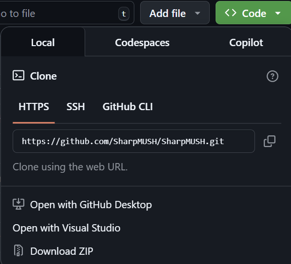
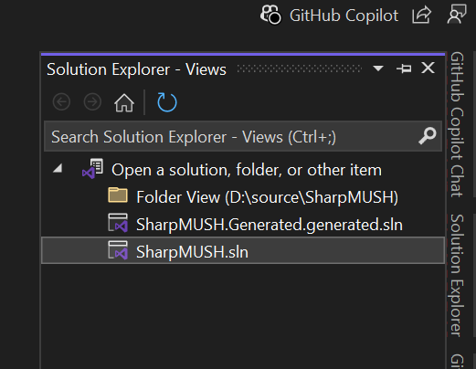
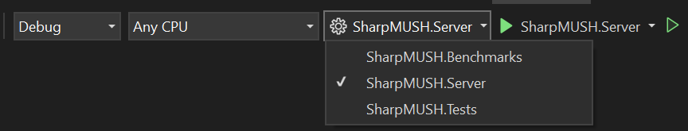

import { Steps } from '@astrojs/starlight/components';

# Install from Source
## Prerequisites
- [Docker](https://www.docker.com/products/docker-desktop/) to run the application.
- [Visual Studio](https://visualstudio.microsoft.com/vs/) or [Jetbrains Rider](https://www.jetbrains.com/rider/) to build the application.

## Steps
<Steps>
1. Clone the repository from [GitHub](https://github.com/SharpMUSH/SharpMUSH).

    

    Open with Visual Studio, or if you have git installed:

    ```bash
    git clone https://github.com/SharpMUSH/SharpMUSH.git
    ```

2. Open the SharpMUSH solution.

    

3. Build the Solution.

    Ensure that the SharpMUSH.Server project is selected as the startup project.
    

    Press F6 to build the solution.

4. Start SharpMUSH!

    Press Ctrl-F5 to start the application in non-debug mode.
    
    An output window will appear and show where to connect.

</Steps>