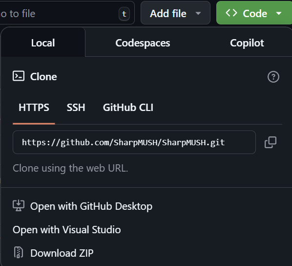
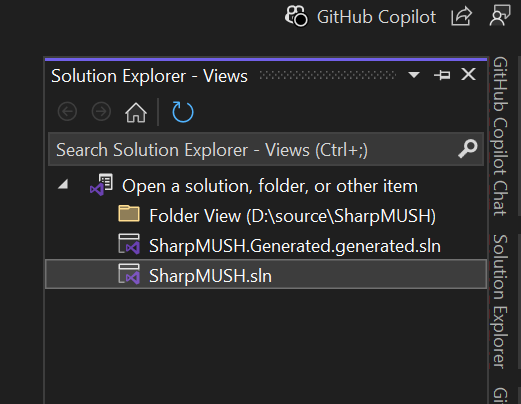
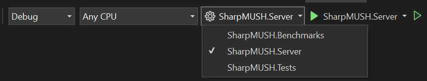

import { Steps } from '@astrojs/starlight/components';

This guide is for building SharpMUSH from source, which is what you want if you intend to modify
the hardcode or contribute to the project. If you only want to *run* a game, the
[Docker quick start](/guides/docker-quickstart) is faster and needs no toolchain.

# Install from Source
## Prerequisites
- [.NET 10 SDK](https://dotnet.microsoft.com/en-us/download/dotnet/10.0) to build and test the application.
- [Docker](https://www.docker.com/products/docker-desktop/) to run the database and messaging containers the server depends on.
- [Visual Studio](https://visualstudio.microsoft.com/vs/) or [Jetbrains Rider](https://www.jetbrains.com/rider/) to build the application.

## Steps
<Steps>
1. Clone the repository from [GitHub](https://github.com/SharpMUSH/SharpMUSH).

    

    Open with Visual Studio, or if you have git installed:

    ```bash
    git clone https://github.com/SharpMUSH/SharpMUSH.git
    ```

2. Open the SharpMUSH solution.

    

3. Build the Solution.

    Ensure that the SharpMUSH.Server project is selected as the startup project.
    

    Press F6 to build the solution.

4. Start SharpMUSH!

    Press Ctrl-F5 to start the application in non-debug mode.
    
    An output window will appear and show where to connect.

</Steps>

## Without an IDE

The solution builds and tests from the command line with the .NET SDK alone:

```bash
git clone https://github.com/SharpMUSH/SharpMUSH.git
cd SharpMUSH
dotnet build
dotnet test
dotnet run --project SharpMUSH.Server
```

The test suite uses [Testcontainers](https://testcontainers.com/), so Docker must be running before
`dotnet test`.

## Next steps

Once the server is up, the [web portal](/guides/web-portal) walks you through first-run setup and is
where you will spend most of your administration time.