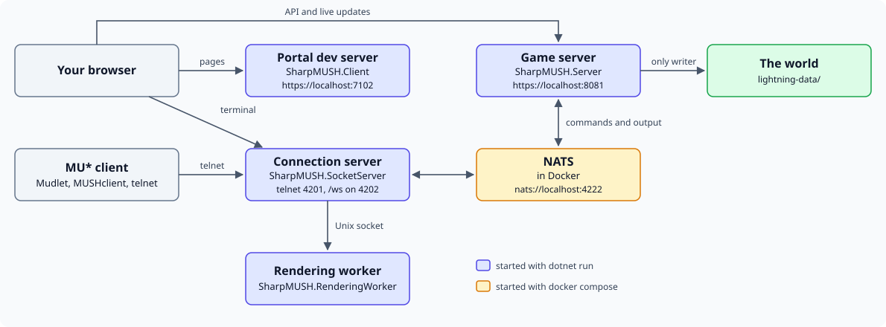

import { Steps, Tabs, TabItem, Aside, LinkCard } from '@astrojs/starlight/components';

This guide is for changing SharpMUSH itself: the server's C# code, the web portal, or the tests. If
you only want to *run* a game, [Run with Docker](/guides/docker-quickstart) is quicker and needs no
toolchain. Softcode, packages and plugins don't need a source build either; see
[Softcode Packages](/guides/packages) and [Writing Plugins](/guides/plugins).

## What runs

SharpMUSH is not one program. A working game on your machine is four .NET processes plus NATS, the
message bus the engine and the connection server talk through:



| Process | What it does | Address |
|---|---|---|
| Game server, `SharpMUSH.Server` | The engine, the world, the API | `https://localhost:8081` |
| Connection server, `SharpMUSH.SocketServer` | Holds telnet and browser-terminal connections | telnet `4201`, `/ws` on `4202` |
| Rendering worker, `SharpMUSH.RenderingWorker` | Formats output for each kind of client | a socket file, no port |
| Portal dev server, `SharpMUSH.Client` | Serves the web portal | `https://localhost:7102` |
| NATS, in Docker | Carries commands and output between the game and connection servers | `nats://localhost:4222` |

In a published image the game server serves the portal itself. A source build doesn't bundle it, so
during development the portal comes from its own dev server and calls the game server's API at
`https://localhost:8081`.

The [Architecture](/technical/architecture) page explains why the parts are split this way.

## What you need

- **The .NET SDK the repository pins**, currently **11.0.100-rc.1**. The `global.json` file at the
  root of the repository names the version; an older SDK stops with "A compatible .NET SDK was not
  found" before it builds anything. Microsoft's install script fetches that exact version:

  <Tabs syncKey="os">
  <TabItem label="Linux and macOS">
  ```bash
  curl -sSL https://dot.net/v1/dotnet-install.sh | bash -s -- --version 11.0.100-rc.1.26425.128
  ```
  </TabItem>
  <TabItem label="Windows">
  ```powershell
  Invoke-WebRequest https://dot.net/v1/dotnet-install.ps1 -OutFile dotnet-install.ps1
  ./dotnet-install.ps1 -Version 11.0.100-rc.1.26425.128
  ```
  </TabItem>
  </Tabs>

  The script doesn't change your `PATH`. Add the folder it reports (`~/.dotnet` on Linux and macOS,
  `%LOCALAPPDATA%\Microsoft\dotnet` on Windows) to your `PATH` before running `dotnet`.

- **Docker**, running. NATS runs in a container, and the test suite starts its own containers.
- **Git**, to clone the repository.
- **A trusted HTTPS development certificate**, so your browser accepts `https://localhost`. Run this
  once:

  ```bash
  dotnet dev-certs https --trust
  ```

- **An editor.** Visual Studio, JetBrains Rider and VS Code with the C# Dev Kit all work, as long as
  they use the SDK above. None is required: everything below works from a terminal.

## Run it from source

This is the setup for day-to-day work: each process runs from your checkout, so you can stop one,
change it, and start it again while the others keep running.

<Steps>

1. Clone the repository and build it.

   ```bash
   git clone https://github.com/SharpMUSH/SharpMUSH.git
   cd SharpMUSH
   dotnet build
   ```

   The first build restores packages and takes a few minutes.

2. Start NATS.

   ```bash
   docker compose up -d nats
   ```

   This starts only the `nats` service from the repository's Compose file, on port 4222, and leaves
   it running in the background.

3. Point the game server and the connection server at it.

   Every terminal that starts one of them needs `NATS_URL`:

   <Tabs syncKey="shell">
   <TabItem label="bash / zsh">
   ```bash
   export NATS_URL=nats://localhost:4222
   ```
   </TabItem>
   <TabItem label="PowerShell">
   ```powershell
   $env:NATS_URL = "nats://localhost:4222"
   ```
   </TabItem>
   </Tabs>

   <Aside type="caution" title="Don't leave NATS_URL unset">
   Without it, each process tries to start a NATS container of its own. When the game server and the
   connection server start at the same moment they can end up with two different ones, and then
   telnet connects but the welcome screen never arrives.
   </Aside>

4. Start the processes, each in its own terminal, from the repository root.

   ```bash
   dotnet run --project SharpMUSH.RenderingWorker
   dotnet run --project SharpMUSH.SocketServer
   dotnet run --project SharpMUSH.Server
   dotnet run --project SharpMUSH.Client
   ```

   Start the rendering worker first, because the connection server sends all output through it. The
   game server is ready when `https://localhost:8081/api/health` answers `{"status":"ready"}`.

   You don't need to set anything else. Each project's launch settings already choose its ports, the
   `Development` environment, and the same rendering socket path (`/tmp/sharpmush-render.sock`) for
   the connection server and the rendering worker.

5. Claim the game.

   Open `https://localhost:7102`. A new world opens on the setup wizard: choose a username and
   password for the administrator account, which is linked to God (`#1`). The wizard then offers to
   import a PennMUSH database and asks which bundled packages to install.

6. Connect a MU\* client.

   Point it at `localhost`, port `4201`, or use the terminal in the portal.

</Steps>

To stop, press <kbd>Ctrl</kbd>+<kbd>C</kbd> in each terminal, then `docker compose stop nats`.

### Where your world is kept

The game server keeps the world in a folder named `lightning-data`, in the folder you started it
from: the repository root, if you followed the steps above. The keys that protect sign-in cookies go
beside it, in `lightning-data.dataprotection-keys`.

To start again from an empty world, stop the game server and delete both folders. The next start
creates a fresh world and the setup wizard appears again.

To keep the world somewhere else, set `SHARPMUSH_LIGHTNING_PATH` before starting the game server.

### In an IDE

Debug whichever process holds the code you're changing. Commands, functions and everything else the
game does run in `SharpMUSH.Server`; telnet and the browser terminal are `SharpMUSH.SocketServer`;
how output looks in each client is `SharpMUSH.RenderingWorker`; pages are `SharpMUSH.Client`.

- **Rider**: the repository ships a run configuration named **Servers and Client** that starts all
  four.
- **Visual Studio**: right-click the solution, choose **Configure Startup Projects**, pick
  **Multiple startup projects**, and set the four projects to **Start**.
- **VS Code**: use the terminal commands above.

Start NATS yourself first, as in step 2. An IDE doesn't read `NATS_URL` from your shell, so set it as
a user environment variable (or in each project's run settings) and restart the IDE.

## Run the whole stack in Docker

To see your change the way it ships, build images from your checkout and run them together:

```bash
docker compose up --build
```

This builds three images (the game server with the portal inside it, the connection server, and the
rendering worker) and starts them with NATS. The portal is at `http://localhost:8080` and telnet on
port `4201`. The world is in the `app-data` Docker volume, so it survives a rebuild. Run the same
command again after a change.

To try the latest build of `main` without building anything, use the published images instead:

```bash
docker compose -f docker-compose-hub.yml up
```

Neither file is meant for hosting a game. For that, use the `deploy/` folder described in
[Run with Docker](/guides/docker-quickstart).

## Settings you might change

Each process reads environment variables, or the same settings from its `appsettings.json` (a double
underscore in a variable name stands for a nested setting, so `ConnectionServer__TelnetPort` is
`ConnectionServer:TelnetPort`).

| Variable | What it does | Default with `dotnet run` |
|---|---|---|
| `NATS_URL` | Where the game server and connection server find NATS | each starts a NATS container |
| `SHARPMUSH_LIGHTNING_PATH` | The game server's world folder | `lightning-data` |
| `PENNMUSH_DATABASE_PATH` | A PennMUSH flatfile the game server imports when it starts | none |
| `ASPNETCORE_URLS` | The game server's addresses | `https://localhost:8081`, `http://localhost:8080` |
| `ConnectionServer__TelnetPort` | The connection server's telnet port | `4201` |
| `ConnectionServer__HttpPort` | The connection server's port for `/ws` | `4202` |
| `Rendering__SocketPath` | The socket file the connection server and rendering worker share; set both to the same file | `/tmp/sharpmush-render.sock` |
| `ASPNETCORE_ENVIRONMENT` | `Development` turns on detailed errors and development-only endpoints | `Development` |

Everything about running a real game (backups, durability, storage limits, history retention) is in
the [Deployment Reference](/guides/deployment).

## Run the tests

The test framework is [TUnit](https://tunit.dev/). Keep Docker running: the main suite starts its own
NATS container, separate from the one you started above, and a MySQL container that the `sql()` and
`@sql` tests query as an external database.

```bash
# The main suite: engine, commands, functions, server
dotnet run --project SharpMUSH.Tests

# One test class, or one test
dotnet run --project SharpMUSH.Tests -- --treenode-filter "/*/*/BuildingCommandTests/*"
dotnet run --project SharpMUSH.Tests -- --treenode-filter "/*/*/BuildingCommandTests/CreateObject"

# Portal components (no Docker needed)
dotnet run --project SharpMUSH.Tests.BUnit

# HTTP, sign-in, packages and other end-to-end checks
dotnet run --project SharpMUSH.Tests.Integration

# The Scene plugin
dotnet run --project SharpMUSH.Tests.ScenePlugin

# The portal's startup scripts
node --test tools/client-tests/*.test.mjs
```

The filter is `/<assembly>/<namespace>/<class>/<test>`, with `*` matching anything. Add
`--output detailed` to see each test as it runs, and set `SHARPMUSH_ENABLE_TEST_CONSOLE_LOGGING=true`
to see the server's log while investigating a failure. The full main suite takes several minutes;
while working, run the classes you touched.

`dotnet test` also runs the tests, with less readable output.

### Comparing with PennMUSH

The repository includes a harness, `tools/parity/run.sh`, that runs the same scripted telnet sessions
against a reference PennMUSH and against SharpMUSH and reports every difference in output. It needs a
built PennMUSH checkout and Python 3.10 or later, and starts its own NATS without Docker. Each fix for
a PennMUSH difference adds a scenario under `tools/parity/scenarios/`.

## Before you open a pull request

- **Formatting is checked on every build.** C# files use tabs. If a build stops with `FORMAT001`,
  run the command in the message, which looks like this, until it reports no changes (it can take two
  passes):

  ```bash
  dotnet format whitespace --folder SharpMUSH.Server --exclude "**/bin/**" --exclude "**/obj/**"
  ```

- **Warnings are errors** in most projects, so a build with a new warning fails.
- **Some files are generated.** The softcode parser's grammar comes from
  `SharpMUSH.Parser.Generated/generate-parser.py`; change that script and run it rather than editing
  `SharpMUSHParser.g4`.
- **Run the tests for what you changed**, and add one that fails without your change.

## Next steps

<LinkCard
  title="Architecture"
  href="/technical/architecture"
  description="What each process owns, and what happens when one of them restarts."
/>

<LinkCard
  title="Writing Plugins"
  href="/guides/plugins"
  description="Add commands, functions, services and portal pages without changing the server."
/>

<LinkCard
  title="Softcode in Your Editor"
  href="/guides/editor-support"
  description="Run the SharpMUSH language server in VS Code, Neovim or Emacs."
/>
