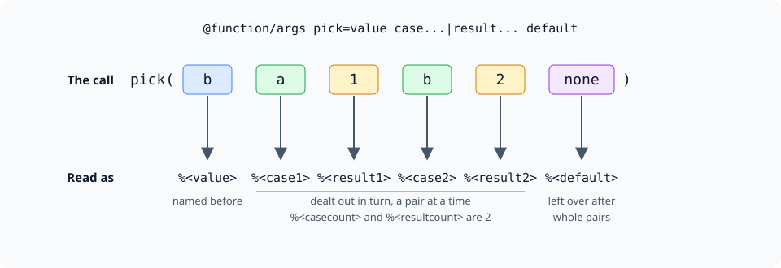

import { Aside } from '@astrojs/starlight/components';

Softcode has always passed arguments by position: the first is `%0`, the second `%1`, and a reader
has to look up what each one means. A **named argument** is passed under a name, and the code reads
it as `%<name>`.

```sharp
&FUN`ROW me=%<name> has %<count> posts.
think uargs(me/FUN`ROW, name, Bob, count, 3)
```

Output: `Bob has 3 posts.`

This page covers:

- how named arguments behave;
- the commands and functions that pass them;
- naming the arguments of a global function or a command;
- handling a variable number of arguments.

The examples here are the ones in the game's own help (`help named arguments`), and SharpMUSH's
test suite runs them on every change, so the output shown is what the game prints.

## How they behave

- `%<name>` reads a named argument, and so does `r(name, args)`.
- Names are not case-sensitive: `%<count>` and `%<COUNT>` are the same argument.
- The name is evaluated, so `%<item[add(1,1)]>` reads `item2`. This is what lets code walk through
  numbered names in a loop.
- `%<0>` is `%0`.
- A name nobody passed is empty.

A named argument belongs to the one call that received it, the same as `%0`. The attribute's own
`u()` calls do not see it, and nothing is left behind when the call returns. A q-register set with
`setq()` lasts until the end of the queue entry, so it can leak into code that never expected it.
When you hand a value to a helper, pass it by name.

## Passing named arguments

| Where | What it passes |
| --- | --- |
| `uargs(<obj>/<attr>, <name>, <value>, ...)` | the pairs, and no `%0`-`%9` |
| `@trigger/args <obj>/<attr>=<name>,<value>,...` | the pairs, and no `%0`-`%9` |
| `@include/args <obj>/<attr>=<name>,<value>,...` | the pairs, alongside the caller's own arguments |
| `stepargs(<obj>/<attr>, <list>, <names>)` | each run's elements under `<names>` |

`stepargs()` is `step()` with names. It takes the list a few elements at a time and passes each
element under the name in its place:

```sharp
&FUN`PAIR me=%<name>=%<count>
think stepargs(me/FUN`PAIR,Bob 3 Alice 1,name count,,|)
```

Output: `Bob=3|Alice=1`

`@include/args` runs another attribute's commands in place, with the names added:

```sharp
&DO`GREET me=&LAST`GREETING me=Welcome, %<who>.
@include/args me/DO`GREET=who,Bob
think get(me/LAST`GREETING)
```

Output: `Welcome, Bob.`

## Naming a global function's arguments

A global function made with `@function` gets its arguments as `%0`, `%1` and so on.
`@function/args <function>=<names>` passes them under names as well, in order:

```sharp
&FN`GREET me=Hello, %<who>. You have %<count> new posts.
@function greet=me,FN`GREET
@function/args greet=who count
think greet(Bob,3)
```

Output: `Hello, Bob. You have 3 new posts.`

`%0` and `%1` still hold `Bob` and `3`, so existing code keeps working. `@function greet` lists the
names, and `@function/args greet=` clears them.

<Aside type="caution">
Global functions are not saved when the game restarts; the usual place to define them is a
`@startup` on God (#1). Redefining a function clears its names, so put each `@function/args` right
after its `@function` in the same `@startup`.
</Aside>

`@function/args` needs the `config.admin` permission.

## A variable number of arguments

The last name can take every argument after the ones before it. The shapes are the ones the
built-in functions use to describe their own parameters in your editor: `switch()`'s read
`string`, `expression...|list...`, `default`. A function of your own is declared the same way.

| Last name | The rest arrive as |
| --- | --- |
| `items...` | `items1`, `items2`, ..., and how many as `itemscount` |
| `key...\|value...` | dealt out in turn: `key1`, `value1`, `key2`, `value2`, ..., each with a count |
| `case...\|result... default` | as above, and `default` takes the argument left over after whole pairs |
| `...` | name and value pairs that the caller names |

### A list of any length

```sharp
&FN`GLUE me=[iter(lnum(1,%<itemscount>),%<items##>,%b,%<sep>)]
@function glue=me,FN`GLUE
@function/args glue=sep items...
think glue(-,a,b c,d)
```

Output: `a-b c-d`

`b c` stays one argument even though it contains a space, because each argument keeps its own name.

### Repeating groups

`key...|value...` deals the arguments out a group at a time, like dealing cards to two players:

```sharp
&FN`LABELS me=[iter(lnum(1,%<keycount>),%<key##>: %<value##>,%b,%b|%b)]
@function labels=me,FN`LABELS
@function/args labels=key...|value...
think labels(Name,Bob,Rank,Captain)
```

Output: `Name: Bob | Rank: Captain`

A group can have more than two names (`key...|value...|note...`). If the last group is short, its
missing names are empty, and each name's count says how many it got.

### Groups with a default

A name after the group takes whatever is left once the whole groups are dealt, the way `switch()`
treats its last argument:



```sharp
&FN`PICK me=[firstof(trim(iter(lnum(1,%<casecount>),if(strmatch(%<value>,%<case##>),%<result##>))),%<default>)]
@function pick=me,FN`PICK
@function/args pick=value case...|result... default
think pick(b,a,1,b,2,none)
think pick(c,a,1,b,2,none)
```

Output: `2`, then `none`.

With an even number of arguments after `value`, nothing is left over and `%<default>` is empty.

### Names the caller chooses

A bare `...` lets each caller pick the names, the way `uargs()` does:

```sharp
&FN`CARD me=%<title>: %<name>, %<rank>
@function card=me,FN`CARD
@function/args card=title ...
think card(Crew,name,Bob,rank,Captain)
```

Output: `Crew: Bob, Captain`

A call that leaves a pair unfinished returns `#-1 NAMED ARGUMENTS COME IN PAIRS`. A pair named with
nothing, a number, or one of the function's own names (`title` here) returns
`#-1 ARGUMENT NAME INVALID`.

### Lists `@function/args` refuses

`@function/args` answers `#-1 ARGUMENT NAME INVALID` and keeps the old names when:

- a name is repeated, ignoring case (`who WHO`);
- a name is a number;
- more than one name takes the rest (`key... value...`; write `key...|value...`);
- a name follows a single `items...`, since nothing would ever be left over for it.

## Naming a command's arguments for its hooks

An `@hook` on a built-in command reads that command's arguments as `LS`, `RS`, `LSA1`, `LSA2` and
the others listed in `help @hook registers`. `@command/args <command>=<names>` gives them names of
your own, in order: the left side, then each right-side argument. The shapes above work here too.

```sharp
&HOOK`CHOWN me=[attrib_set(me/LAST`CHOWN,%<attribute> to %<owner>)]
@command/args @atrchown=attribute owner
@hook/before @atrchown=me,HOOK`CHOWN
&NOTE me=hello
@atrchown me/NOTE=me
think get(me/LAST`CHOWN)
```

Output: `me/NOTE to me`

`@command/args` needs the `config.admin` permission and lasts until the server restarts, like the
other `@command` switches, so it belongs in a `@startup` too. A hook cannot refuse the command it is
attached to: when a command named with a bare `...` is given an unfinished pair, its hook simply
gets none of the pairs.

## Arguments the game names for you

Some code is called by the game rather than by softcode, and the game passes it named arguments:

- **`@hook` attributes**: `ARGS`, `LS`, `RS`, `EQUALS`, `SWITCHES`, `LSAC` and `LSA1`, `LSA2`, ....
- **`@http` callbacks**: `%<status>` and `%<content-type>`, with the response body in `%0`.
- **`@input` callbacks**: `%<reason>`, which is `exit`, `input` or `timeout`.
- **Regular-expression `$`-commands**: each named capture in the pattern.
- **`mapsql()`**: each column, by its name.

<Aside>
A database imported from PennMUSH turns on the `http_qregisters` option, so `@http` callbacks there
also set the `STATUS` and `CONTENT-TYPE` q-registers that PennMUSH code expects. A new game leaves
it off.
</Aside>
