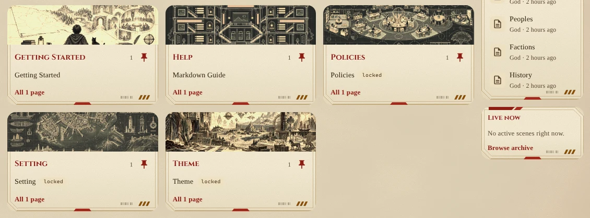

import { Aside, Steps } from '@astrojs/starlight/components';

A portal theme decides how the web portal looks: its colours, its typefaces, what is drawn on the page and on
every card, and how titles are set. Players choose one under **Settings > Theme**. Staff make and edit themes at
**Admin > Portal > Themes** (`/admin/themes`), which needs the `layout.admin` permission.

Portal themes are separate from [layout themes](/guides/layout-themes), which colour the boxes and tables in
a MU\* client.

## How a theme is put together

A theme is two things:

- **Colours.** Thirteen colours for the page, cards, text, lines and links, checked for contrast, plus two
  **decorative colours** that only drawings use.
- **Parts.** Named choices for each piece of the look: the title face, the text face, corners, title lettering,
  picture tone, the page texture, and the card drawing, border and shadow, the title glyphs and underline, and
  the title colour and shadow.

A part is never a colour of its own. Every drawing is filled with the theme's colours, so the same part looks
right on a dark theme and a light one, and changes with the theme's accent.


## Three ways to edit a theme

At the top of the **Style** section, choose how you want to edit:

**Simple** is one menu for each part of the look, as every built-in theme is made. Choosing a texture, card
frame, title ornament or title effect brings everything that goes with it. The **Plating** card frame, for
example, sets the plating drawing, no border and no shadow.

**Complex** gives every part its own menu, so you can mix them: one theme's card drawing with another's border
and shadow, one theme's title glyphs with another's underline. It also shows the two decorative colours and
**Texture strength** (full, soft, faint or off), which fades the page texture.

**Custom (CSS)** keeps the Complex menus and adds a stylesheet of your own, laid over everything. Use it for
what the menus can't do: a drawing on a different layer, two textures at once, or a change to one part of the
portal.

Switching from Simple to Complex changes nothing on the page: each menu starts at the part your Simple choices
gave. Switching back to Simple asks first if the parts no longer match a Simple choice, then puts them back.
Leaving Custom asks first, then removes the stylesheet.

### Mix parts in Complex

To give the Fantasy theme the armour plating from Real Robot:

<Steps>

1. Open **Admin > Portal > Themes**, choose **Fantasy**, and press **Duplicate**. Built-in themes can't be
   changed, so you edit a copy.

2. Under **Style**, choose **Complex**.

3. Set **Card drawing** to **Armour plating** and **Card border** to **None**. The plating draws its own edge.

4. Pick the two **Decorative colours**. The plating's tab stripe and chin plate use the first, its vents the
   second.

5. Turn on **Try on the portal** to see it everywhere, then **Save**.

</Steps>



Every part, its values, and the built-in theme each comes from are listed under [Parts](#parts) below.

## Decorative colours

Some drawings need more colours than a theme's accent: the three spotlights of the Idol texture, or the red and
yellow on Real Robot's armour. These come from the two decorative colours. They never carry text, so the contrast
report doesn't check them. A theme that doesn't set them uses its **Errors and missing links** colour and its **Warning**
colour.

## Write your own CSS

In **Custom (CSS)** mode the stylesheet box starts with a guide that changes nothing until you edit it:

1. Every variable the portal paints with, with this theme's value, commented out.
2. The rules this theme's parts use, copied out as `:root` rules and commented out. Remove the `/*` and `*/`
   around one to make it the theme's own, then change it.
3. An empty rule for each part of the portal (the page, the sidebars, cards, page headers, wiki pages, buttons),
   for anything a variable can't reach.

Your stylesheet loads after the parts, so anything it sets wins. The portal refuses to save a stylesheet that
loads from another site, or holds HTML or script.

### How drawings are painted

The page texture and every card have six layers. The bottom layer holds plain gradients (`--texture` on the page,
`--card-marks` on a card). Above it is one layer for each of the theme's colours: the border colour, the text
colour, decorative 2, decorative 1 and the accent, with the accent on top. A layer is filled with its colour
wherever its **mask** lets it through. The mask is a drawing, black where the colour shows and clear where it
doesn't.

| Variable | What it does |
|---|---|
| `--texture`, `--texture-size` | The page's gradients and their sizes, as for `background-image` and `background-size` |
| `--texture-mask-text`, `--texture-mask-accent`, `--texture-mask-accent-2`, `--texture-mask-accent-3`, `--texture-mask-border` | The drawing each colour fills on the page. A list in the `mask` shorthand: `url(...) position / size repeat` |
| `--texture-ink-text`, `--texture-ink-accent`, ... | The colour itself. Set it to make a layer fainter: `color-mix(in srgb, var(--accent) 40%, transparent)` |
| `--texture-opacity` | The whole texture's strength, from 0 to 1 |
| `--card-marks` | A card's gradients, over its background |
| `--card-mask-text`, `--card-mask-accent`, ... , `--card-mask-grain` | The drawing each colour fills on every card. `grain` is the paper grain some textures put on cards |
| `--card-ink-text`, `--card-ink-accent`, ... , `--card-ink-grain` | The colour of each card layer |
| `--card-border-style`, `--card-border-width`, `--card-shadow` | A card's border and shadow |
| `--ornament-before`, `--ornament-after` | The glyphs either side of page titles, as CSS strings (`"\2726"`) |
| `--title-underline`, `--title-underline-height`, `--title-underline-pad` | The line under page titles (a gradient), how tall it is, and the gap above it |
| `--title-color`, `--title-shadow` | The colour of titles, and what is drawn behind them (a `text-shadow` list) |
| `--accent-2`, `--accent-3` | The two decorative colours |

Every drawing the built-in parts use is on the site under `/themes/drawings/`, so you can use any of them in your
own masks. The ones under `/themes/drawings/shared/` are made to tile: `noise.svg` (fine grain, 180px),
`clouds-360.svg` to `clouds-800.svg` (soft mottling at those sizes), and `starfield-200.svg`, `starfield-320.svg`
and `starfield-530.svg` (stars at those sizes).

### Example: stars over any texture

This puts two depths of stars, in the text colour at 60%, over the page:

```css
:root {
	--texture-mask-text: url(/themes/drawings/shared/starfield-200.svg) 0 0 / 200px 200px,
		url(/themes/drawings/shared/starfield-320.svg) 0 0 / 320px 320px;
	--texture-ink-text: color-mix(in srgb, var(--text) 60%, transparent);
}
```

A variable set here replaces the texture's own value for that layer. If the theme's texture also draws in the
text colour (Parchment's grain does), copy its rule from the starter and add the stars to the end of its list.

### Example: two card frames at once

Fantasy's flourished corners, filled with the accent, and Modern's bar down the left side:

```css
:root {
	--card-mask-accent: url(/themes/drawings/frames/filigree-accent.svg) 0 0 / 100% 100% no-repeat;
	--card-marks: linear-gradient(var(--accent), var(--accent)) left top / 5px 100% no-repeat;
}
```

### Example: change one part, keep the menus

A rule can name a part's value, so it only applies while that value is chosen. This makes the Mystery theme's
tape fainter, whatever else the theme changes:

```css
[data-frame-marks="tape"] {
	--card-ink-accent-2: color-mix(in srgb, var(--accent-2) 10%, transparent);
}
```

Each part is an attribute on the page: `data-texture`, `data-texture-strength`, `data-frame-marks`,
`data-frame-edge`, `data-frame-shadow`, `data-ornament-glyphs`, `data-ornament-underline`, `data-effect-color`,
`data-effect-shadow`, `data-font-display`, `data-font-body`, `data-corners`, `data-titles` and `data-imagery`.
`data-scheme` is `dark` or `light`, for a rule that should differ between the two:
`[data-scheme="dark"][data-texture="paper"] { ... }`.

## Parts

Each table lists a part's values, what each draws, and the built-in themes that use it. The rest of the parts
are short lists:

| Part | Values |
|---|---|
| Card border (`data-frame-edge`) | `line`, `thick`, `heavy`, `double`, `outset` (raised), `none` |
| Title colour (`data-effect-color`) | `text`, `accent`, `warn` |
| Texture strength (`data-texture-strength`) | `normal` (full), `soft`, `faint`, `off` |
| Corners (`data-corners`) | `soft`, `sharp`, `round`, `candy`, `razor`, `pill` |
| Title lettering (`data-titles`) | `normal`, `caps`, `italic`, `slant`, `wide` |

### Texture

What is drawn on the page behind everything. Most textures use several of the theme's colours. Attribute: `data-texture`.

| Value | Draws | Built-in themes |
|---|---|---|
| `none` | Nothing. | — |
| `grain` | Fine noise over the page and the cards. | — |
| `paper` | A grained page darkening toward its edges. | — |
| `linen` | A fine weave of crossed threads; the cards are grained. | — |
| `grid` | Graph paper ruled every 28px. | — |
| `scanlines` | Fine horizontal lines in the accent under a glow from above. | Science Fiction |
| `stars` | A few points of light repeating every 190px, one in the accent. | — |
| `mist` | An accent haze from the top left and a faint one in the bottom right. | — |
| `damask` | Accent dots on a fine diagonal lattice. | — |
| `lace` | Interlocking accent rings with a dot in each. | — |
| `velvet` | A sheen from the top left, a mottled accent nap, and fine grain. | — |
| `parchment` | Edges browned as if near a flame, stains, and fibres; the cards are grained. | Fantasy |
| `foxing` | The brown spots of an old book, on a faint weave, browning at the edges; the cards are grained. | Historical |
| `blood` | The accent pooling from below and the corner, stained and grainy. | Horror |
| `blinds` | Light through venetian blinds over grain, falling off into the dark away from the window. | Mystery |
| `petals` | Rose petals drifting across the page, under a blush from above. | Romance |
| `mandala` | A mandala drawn in fine lines, rising from the top of the page in a soft light. | Spiritual |
| `swiss` | A layout grid, major lines in the accent every 168px over a fine 28px grid. | Modern |
| `sparkles` | Four-point stars and glitter over a pink and decorative 1 wash from two corners. | Magical Girl |
| `bubbles` | A screentone of fine dots behind pale floating bubbles and outlined blossoms in three colours. | Shojo |
| `spotlights` | Spotlight beams in three colours from the rig, a glow off the floor, glitter in the air. | Idol |
| `notebook` | Ruled lines, a double margin line just past the rail and sidebar, and a little grain. | Slice of Life |
| `speedlines` | Manga focus lines converging on the page, over screentone rising from the foot. | Shonen |
| `court` | A court's markings at night, under two floodlights, with a little grain. | Sports |
| `hazard` | Riveted armour plates under a work light, with a band of hazard stripes along the top. | Mech Machine |
| `sigil` | A magic circle glowing behind the page, its seals in the accent, with motes of light. | Isekai |
| `sumi` | A moon behind bands of mist, lantern light from below, waves along the foot, ink-wash cloud and paper fibres. | Yokai |
| `benday` | Accent and decorative 2 halftone screens on yellowing newsprint, with grain. | Comic Book |
| `filmgrain` | Old film: a vignette, scratches and dust over fine grain, and a slow flicker. | Rubber Hose |
| `starburst` | A toy-box night sky of sparkles, bursts and a lightning bolt, lit decorative 1 and decorative 2 from the corners. | 80s Cartoon |
| `rain` | Streaks falling past a magenta glow from the street, a cyan sign above and a yellow one below. | Cyberpunk |
| `outrun` | A striped sun sinking behind a neon grid floor. | Synthwave |
| `galaxy` | Deep space: three depths of stars, a faint galactic band, and a planet rising from the corner. | Space Opera |
| `readout` | A console readout: coloured segments down the page's right edge, with ticks. | Starship Console |
| `armor-panels` | Pale armour plating with panel lines, hatches and decals, a stripe and caution marks. | Real Robot |
| `sunburst-rays` | Rays in three colours bursting from below the page round a hot glow, with drifting embers. | Super Robot |

### Card drawing

What is drawn on every card, over its background and under its text. Attribute: `data-frame-marks`.

| Value | Draws | Built-in themes |
|---|---|---|
| `none` | Nothing. | Historical |
| `corners` | Accent ticks on a card's four corners. | Science Fiction |
| `filigree` | A scrolled flourish in each corner. | Fantasy |
| `drip` | Drips running down from the top edge. | Horror |
| `tape` | A strip across each top corner in the second accent, as on a photograph pinned to a board. | Mystery |
| `bar` | A solid accent bar down the left side. | Modern |
| `deco` | Three stepped rules ending in diamonds, in the accent on each corner. | — |
| `halo` | A line of light along the top of a card, and a glow falling from it. | Spiritual |
| `scallop` | Lace scallops along the top and bottom edges, with a dot under each top one. | Romance |
| `ribbon` | A ribbon bow tied at the top corner with a sparkle on its loop, over a pink-to-decorative 1 hem. | Magical Girl |
| `bloom` | Sprays of blossoms and leaves in three colours at the card's two right-hand corners. | Shojo |
| `stage` | Rows of stage lights in three colours along the top and foot, light rising from the floor. | Idol |
| `washi` | A dotted strip across the top edge and a two-colour striped one across the corner below. | Slice of Life |
| `panel` | Screentone shading into the card's bottom right corner. | Shonen |
| `jersey` | An accent band along the foot, a pale stripe above it. | Sports |
| `chamfer` | An armour plate: two corners cut off and edged in the accent, a hazard-striped tab and rivets. | Mech Machine |
| `status` | A lit band at the top, a diamond in each corner. | Isekai |
| `shoji` | Paper-screen lattice in the corners, and a seal stamped in the bottom right. | Yokai |
| `inked` | An decorative 1 caption box ruled off in ink behind the heading, and a halftone swelling to the far corner. | Comic Book |
| `titlecard` | A vignette darkening toward the card's edges. | Rubber Hose |
| `chunky` | A plastic sheen across the top. | 80s Cartoon |
| `glitch` | Two corners cut on the diagonal, edges fading to the border, and a glitch on the right. | Cyberpunk |
| `neon` | The accent from the top, decorative 2 from the bottom. | Synthwave |
| `hull` | A worn hull plate: a bevel, rivets in the corners, brushed metal, dark stains and a painted tab. | Space Opera |
| `elbow` | A console card: an accent elbow round the top-left corner, carried on as coloured bars along the top and down the left. | Starship Console |
| `plating` | An armour plate with bevelled corners, an engraved panel line, part-number ticks, a striped tab, a chin plate and vents. | Real Robot |
| `chrome-armor` | Rivets in the corners, a chrome trim along the top, scorched side plates, a chevron, and a sheen falling off into shadow. | Super Robot |

### Card shadow

The shadow or glow round every card. Attribute: `data-frame-shadow`.

| Value | Draws | Built-in themes |
|---|---|---|
| `none` | No shadow. | Fantasy, Mech Machine, Modern, Real Robot, Science Fiction, Shonen, Starship Console |
| `glow` | A faint accent ring and haze. | — |
| `inset` | A second border line inside the first. | — |
| `engraved` | An inner rule in the text colour, as on an engraved plate. | Historical |
| `drip` | A faint accent haze. | Horror |
| `tape` | The card lifted off the board. | Mystery |
| `deco` | A faint accent rule outside the border. | — |
| `halo` | A soft accent glow below the card. | Spiritual |
| `scallop` | A faint accent blush below the card. | Romance |
| `ribbon` | A soft accent halo round the card and a pink glow beneath. | Magical Girl |
| `bloom` | A faint, soft drop shadow. | Shojo |
| `stage` | An accent rim glowing out into the dark, with a second colour far out. | Idol |
| `washi` | A hairline and a warm, low shadow. | Slice of Life |
| `jersey` | A jersey card lifted off the floor. | Sports |
| `status` | A status window's glow in the border colour. | Isekai |
| `shoji` | A shoji frame's inner rule and a faint lantern glow. | Yokai |
| `inked` | A hard ink shadow. | Comic Book |
| `titlecard` | An inner ink rule inset from the border, and a soft drop. | Rubber Hose |
| `chunky` | A lit top edge and a hard decorative 1 shadow. | 80s Cartoon |
| `glitch` | The card's edge offset in decorative 1 and the accent, in a faint glow. | Cyberpunk |
| `neon` | A neon tube's glow round the card, inside and out. | Synthwave |
| `hull` | A hull plate's bevel and the shadow it casts. | Space Opera |
| `chrome-armor` | A lit top edge and shadowed foot, a hard black drop, a deep shadow and an decorative 2 glow. | Super Robot |

### Title glyphs

The marks either side of page and banner titles. Attribute: `data-ornament-glyphs`.

| Value | Draws | Built-in themes |
|---|---|---|
| `none` | Nothing. | Historical, Mystery, Synthwave |
| `diamond` | An open diamond either side. | — |
| `fleuron` | A hedera before, a rotated floral heart after. | Fantasy |
| `star` | A four-pointed star either side. | — |
| `brackets` | Square brackets either side, as on a readout. | Science Fiction |
| `cross` | A dagger either side. | Horror |
| `heart` | An outlined heart either side. | Romance |
| `lotus` | A flower either side. | Spiritual |
| `deco` | An art deco diamond either side. | — |
| `block` | A solid square before. | Modern |
| `twinkle` | Twinkles either side of the title. | Magical Girl |
| `blossom` | Blossoms either side of the title. | Shojo |
| `encore` | Stars either side of the title. | Idol |
| `doodle` | A pencil before the title. | Slice of Life |
| `exclaim` | A shout after the title, and a bar under most of it. | Shonen |
| `varsity` | A star either side. | Sports |
| `warning` | Corner wedges either side, like a hazard sign. | Mech Machine |
| `cursor` | A menu's pointer before the title. | Isekai |
| `hanko` | A seal after the title. | Yokai |
| `pow` | A comic burst either side. | Comic Book |
| `vaudeville` | A star either side. | Rubber Hose |
| `bolt` | A zigzag arrow before, an eight-point star after. | 80s Cartoon |
| `slash` | A double slash before the title. | Cyberpunk |
| `insignia` | A bar and a diamond either side. | Space Opera |
| `segments` | A pill bar before the title. | Starship Console |
| `tricolor` | A cut corner before. | Real Robot |
| `battlecry` | Guillemets pointing in at the title. | Super Robot |

### Title underline

The line under page titles. Attribute: `data-ornament-underline`.

| Value | Draws | Built-in themes |
|---|---|---|
| `none` | No line. | Comic Book, Horror, Mech Machine, Modern, Science Fiction, Spiritual, Sports |
| `fade` | An accent rule fading out to the right. | Fantasy, Isekai, Mystery, Romance, Space Opera |
| `double` | A thick and a thin accent rule. | Historical |
| `twinkle` | An underline running from the accent into decorative 1 and fading out. | Magical Girl |
| `blossom` | A dotted underline of short dashes. | Shojo |
| `encore` | An underline in the three stage-light colours. | Idol |
| `doodle` | A dashed underline, as if drawn by hand. | Slice of Life |
| `exclaim` | A hard bar under the first seven tenths. | Shonen |
| `hanko` | A brush stroke laid on in one pass, running dry at its end. | Yokai |
| `vaudeville` | A plain ink rule. | Rubber Hose |
| `bolt` | Decorative 1, accent and decorative 2 thirds. | 80s Cartoon |
| `slash` | The accent running into decorative 1, fading out. | Cyberpunk |
| `sunset` | Decorative 1 to decorative 2 to the accent, fading out. | Synthwave |
| `segments` | Coloured segment bars with gaps. | Starship Console |
| `tricolor` | An accent bar, then shorter decorative 1 and decorative 2 bars, with gaps. | Real Robot |
| `battlecry` | Accent, decorative 1 and decorative 2 bands burning out. | Super Robot |

### Title shadow

What is drawn behind the letters of page and card titles. Attribute: `data-effect-shadow`.

| Value | Draws | Built-in themes |
|---|---|---|
| `none` | No shadow. | Modern, Starship Console |
| `glow` | An accent glow, tight and wide. | Science Fiction, Spiritual |
| `gilt` | A light catching the lower edge; on a dark theme, a shadow and a faint accent glow. | Fantasy, Romance, Space Opera |
| `emboss` | A highlight below and a shade above, pressed into the page. | Historical |
| `ember` | A dark drop and an accent glow. | Horror |
| `bleed` | Ink spread into the paper, as from a typewriter. | Mystery |
| `shine` | A glossy highlight above, a decorative 1 edge below and a soft accent glow. | Magical Girl |
| `dreamy` | A white halo with a faint accent glow beneath. | Shojo |
| `lightstick` | Glowing like a lightstick in the accent, a second colour offset behind. | Idol |
| `pencil` | A faint pencil echo offset down and right. | Slice of Life |
| `inked` | A hard accent shadow, offset like a misregistered print. | Shonen |
| `varsity` | Outlined in the accent, with a drop shadow. | Sports |
| `stencil` | A hard shadow under sprayed letters. | Mech Machine |
| `pixel` | A hard drop shadow and a soft accent glow. | Isekai |
| `lantern` | Lit from behind in the accent. | Yokai |
| `inkpop` | A thin ink outline and a hard ink drop. | Comic Book |
| `cartoon` | A soft accent drop. | Rubber Hose |
| `toybox` | A thick black outline and a deep decorative 1 drop. | 80s Cartoon |
| `rgbsplit` | Decorative 1 to the left, the accent to the right, in a glow. | Cyberpunk |
| `retro` | The accent with an decorative 2 drop and glow. | Synthwave |
| `decal` | An decorative 1 offset print. | Real Robot |
| `blazing` | A scorched decorative 2 extrusion, a black edge, and decorative 1 and decorative 2 fire behind. | Super Robot |

