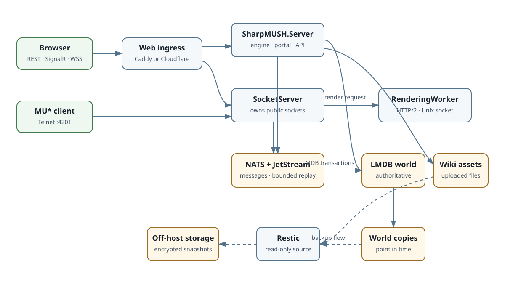

import { LinkCard } from '@astrojs/starlight/components';

SharpMUSH separates the game engine from the process that holds players' connections and from the
worker that formats output. That lets routine engine and renderer updates keep telnet and browser
connections open. The supplied production setup is a single machine with an embedded LMDB database
and NATS; it is not built to spread one game across several machines.

How the pieces connect:

- Browsers reach the portal, its REST API and its live updates over HTTPS, and the terminal over
  `wss://…/ws`, through Caddy or a Cloudflare Tunnel. The proxy sends ordinary web traffic to the game
  server (`SharpMUSH.Server`, port 8080) and `/ws` to the connection server (`SharpMUSH.SocketServer`,
  port 4202).
- MU\* clients connect straight to the connection server on telnet port 4201.
- The connection server formats output through the rendering worker (`SharpMUSH.RenderingWorker`)
  over HTTP/2 on a private Unix socket.
- The connection server and game server exchange commands and output through NATS.
- The game server alone reads and writes the world (LMDB) and the uploaded wiki files, and makes the
  point-in-time world copies that backups read.
- The restic backup container reads the finished copies and the wiki files and sends encrypted
  snapshots off the machine.
- Prometheus scrapes the private `/metrics` endpoints of the game and connection servers, and Compose
  health checks watch every service.

## What each part owns

| Component | Owns | When it restarts | How to tell it is healthy | What protects it |
|---|---|---|---|---|
| Caddy or Cloudflare Tunnel | The public web entrance and HTTPS | The portal, its live updates and the browser terminal pause; telnet is separate | The proxy or tunnel's status, plus loading the portal and `/ws` over HTTPS | Configuration and secrets management; it holds no world data |
| `SharpMUSH.Server` | The engine, REST API, live updates, the portal's files, login and session decisions, the world, wiki files | The portal and its live updates restart; the connection server keeps players connected and catches up when the engine returns | Readiness and health checks, logs, server metrics, a test login and command | Point-in-time world copies, the wiki files, deployment settings |
| `SharpMUSH.SocketServer` | Every public telnet and browser terminal connection | Every connection closes; a logged-in browser can recover within a limited window, telnet reconnects | Service health, connecting over telnet and `/ws`, connection metrics | NATS's stored data can bring back a browser session, never the closed connection itself |
| `SharpMUSH.RenderingWorker` | Formatting output for each kind of client, behind a private Unix socket | Connections stay open; output waits and retries until it is back | The connection server checks its health over the Unix socket | Image and settings only; it holds no game data |
| NATS with JetStream | Messages between the parts of the game, and what browsers need to recover | Coordination and recovery suffer; the world itself is untouched | NATS health, logs, storage limits and its volume | Its persistent volume, if browser recovery across restarts matters to you |
| LMDB world | The game world, in the game server's `app-data` volume | The game server cannot run without it | `@storage`, storage metrics, server readiness, database errors in the logs | Only finished `@backup` copies; never a read of the live file |
| Wiki files | Uploaded files, kept outside the world | Pages can still exist while their files are missing | Fetching files in the portal | A direct restic snapshot of the folder |
| Restic and off-machine storage | Encrypted recovery copies away from the machine | No effect until you need to recover | The nightly result, repository checks, restore drills | Holds the chosen world copies, wiki files, plugins and settings, not running processes |

<LinkCard
  title="Connections During Updates"
  href="/technical/connections"
  description="Which restarts disconnect players, what they see, and how far a browser session can recover."
/>

<LinkCard
  title="Operator Handbook"
  href="/guides/operator-handbook"
  description="Use these boundaries when planning backups, upgrades, monitoring, and incident response."
/>
